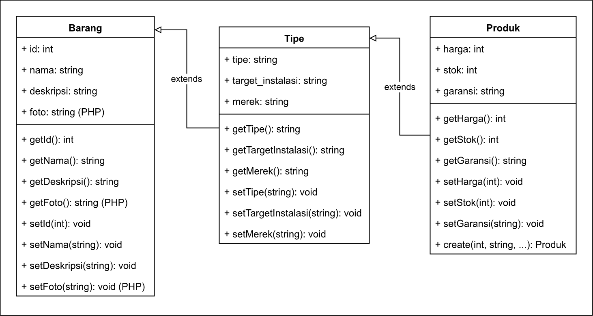

# Tugas Praktikum DPBO #2

Dibuat untuk menyelesaikan TP2 Desain Pemrograman Berorientasi Objek (DPBO)

## Janji

Saya Willsoon Tulus Parluhutan Simanjuntak dengan NIM 2404756 mengerjakan evaluasi Tugas Praktikum 2 dalam mata kuliah Desain Pemrograman Berorientasi Objek untuk keberkahanNya maka saya tidak melakukan kecurangan seperti yang telah dispesifikasikan. 

Aamiin.

## Penjelasan Desain dan Code Flow

Program memiliki tiga kelas, yaitu kelas "Barang", "Tipe", dan "Produk" sesuai dengan peta UML berikut:

Variabel dan metode untuk kelas "Barang" tersebut terdiri dari:

- id: int
- nama: string
- deskripsi: string
- foto: string (khusus PHP)
- Metode getter untuk mendapatkan atribut
- Metode setter untuk mengatur atribut

Variabel dan metode untuk kelas "Tipe" terdiri dari:

- tipe (string)
- target_instalasi (string)
- merek (string)
- Metode getter untuk mendapatkan atribut
- Metode setter untuk mengatur atribut

Variabel dan metode untuk kelas "Produk" terdiri dari:

- harga (int)
- stok (int)
- garansi (string)
- Metode getter untuk mendapatkan atribut
- Metode setter untuk mengatur atribut

Program ini memiliki desain 3 kelas dengan atribut dan metode getter/setter masing-masing. Kelas "Barang" merupakan kelas inti serta mendefinisikan deskripsi dari suatu barang/item. Kelas "Tipe" merupakan kelas yang mendefinisikan suatu karakteristik lanjut dari suatu barang/item, seperti tipe, merek, dan target instalasi (dalam konfigurasi apakah barang tersebut akan digunakan). Kelas "Produk" merupakan kelas yang mendefinisikan sebuah produk yang akan menjadi bagian dari penjualan suatu toko elektronik, yang memiliki karakteristik seperti harga, stok, dan garansi dari produk masing-masing.

Untuk versi CLI memiliki menu sebagai berikut:

1. Tambah produk
2. Tampilkan list produk
0. Keluar dari program

Setiap menambahkan suatu produk, program akan meminta inputan atribut secara berurutan dari nama hingga garansi. Inputan ID tidak diminta, karena program akan secara otomatis diisi secara berurutan (atau yang biasa disebut dengan auto increment).

Saat menampilkan list produk, program akan menampilkan kumpulan dari produk yang tersedia dalam bentuk tabel dengan panjang kolom dinamis, yang akan menyesuaikan dengan atribut terpanjang dari keseluruhan data yang tersedia.

Program ini tidak menyimpan data secara permanen, dan tidak akan tersedia kembali setelah menutup maupun memulai ulang program.

## Deskripsi kode program

Untuk C++, Java, dan Python, menggunakan CLI dan memiliki tampilan antarmuka yang sama. 

Terdapat ketentuan operasional untuk versi CLI:

- Tidak ada batasan yang ditentukan mengenai seberapa banyaknya produk yang bisa ditambahkan.
- Untuk C++, atribut Nama dan Deskripsi dapat diisi baik dengan spasi namun tanpa spasi. Untuk Java dan Python, seluruh atribut string dapat diisi dengan atau tanpa spasi.
- Untuk Java dan Python, inputan angka memiliki error handling jika memasukkan huruf dalam inputan angka.

Untuk PHP, menggunakan Web GUI dan memiliki tampilan antarmuka berupa tabel. Data disimpan dalam satu sesi saja mengunakan $_SESSION dan tidak menggunakan sistem manajemen basis data seperti MariaDB dan sejenisnya.

## Preview operasional program

C++:

Java:

Python:

PHP:

